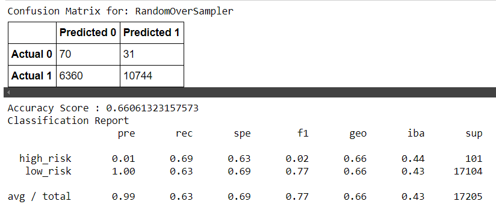
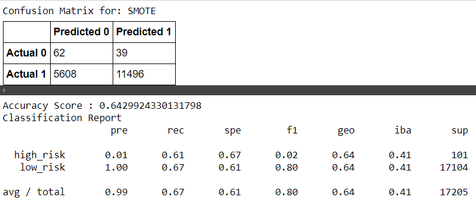
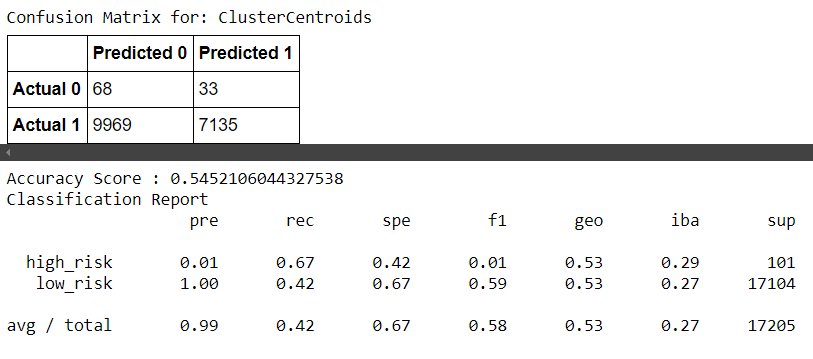
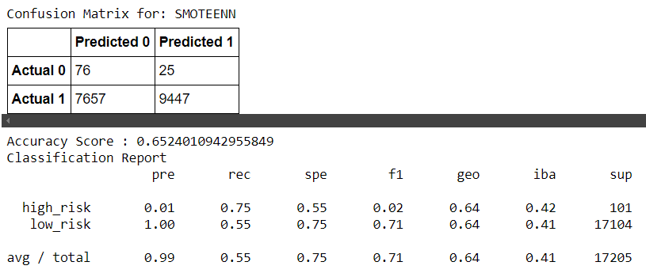
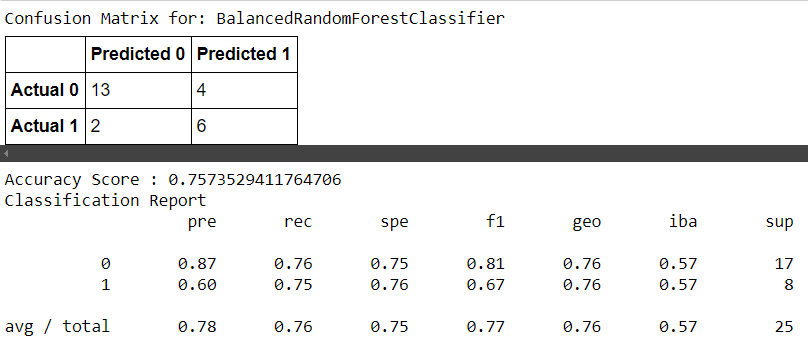
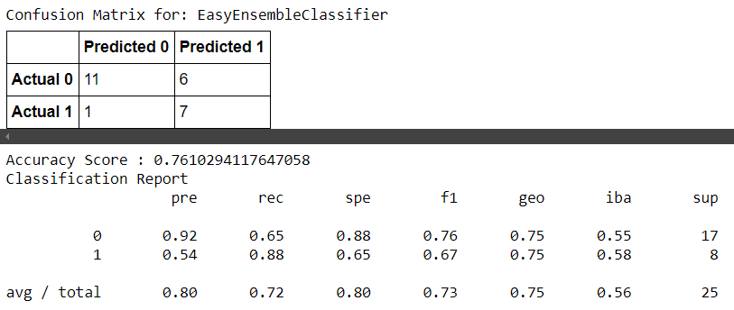

# Credit Risk Analysis

## Overview of the analysis: 
The purpose of this analysis is to review different techniques to train and evaluate machine learning models on a credit card dataset from LendingClub. 

## Results: 
Below are the results of six machine learning models.
1. Naive Random Oversampling
 

- The accuracy score is 0.66. The precision score is 1.00, a high score, indicating a high number of true positives. The recall is  0.63, a high score, indicating a low number of false negatives.

2. SMOTE Oversampling
 

- The accuracy score is 0.64, meaning. The precision score is 1.00, a high score, indicating a high number of true positives.. The recall is  0.62, a high score, indicating a low number of false negatives.

3. ClusterCentroids Undersampling
 

- The accuracy score is 0.55, meaning. The precision score is 1.00, a high score, indicating a high number of true positives.. The recall is  0.42, a low score, indicating a high number of false negatives.

4. SMOTEEN Combination Sampling
 

- The accuracy score is 0.65, meaning. The precision score is 1.00, a high score, indicating a high number of true positives. The recall is  0.55, a high score, indicating a low number of false negatives.

5. BalancedRandomForestClassifier
 

- The accuracy score is 0.76. The precision score is  0.60, a high score, indicating a high number of true positives. The recall is 0.75, a high score, indicating a low number of false negatives.

6. EasyEnsembleClassifier
 

- The accuracy score is 0.76. The precision score is  0.54, a high score, indicating a high number of true positives. The recall is 0.88, a high score, indicating a low number of false negatives.

## Summary:
Overall, all models had accuracy, recall, and F1 scores of around 0.40 - 0.80. I would recommend using the SMOTE model because it has the highest F1 score of 0.80 and 1.00 precision. 
